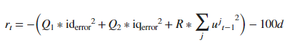
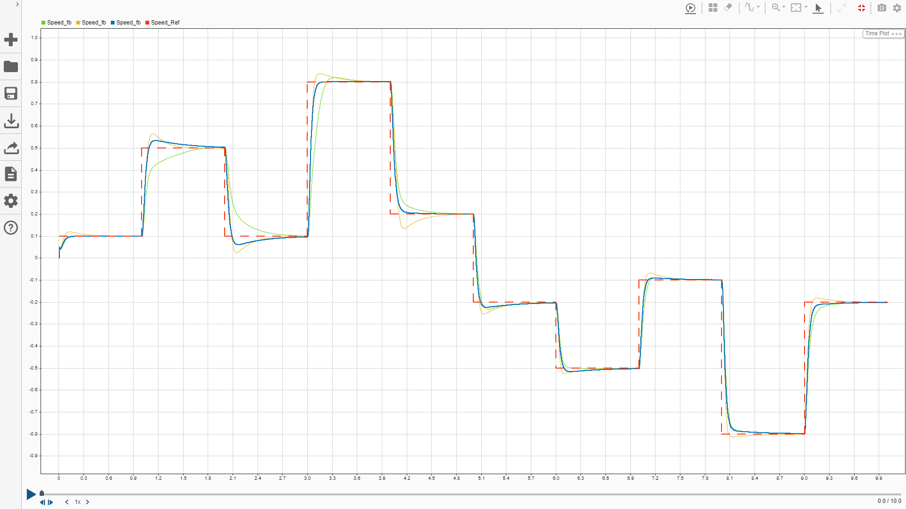
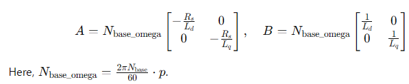
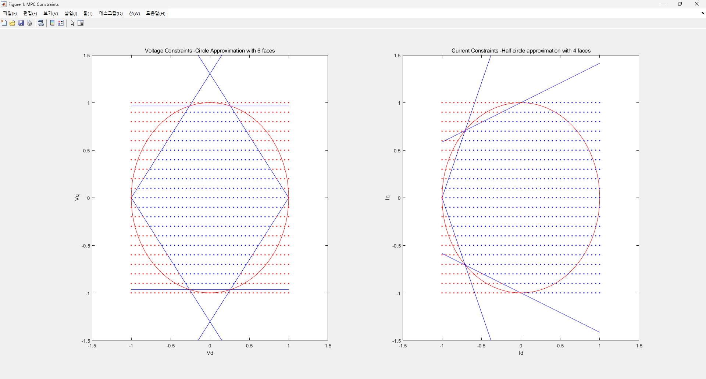

# Simulation

This contains simulations for controlling a Permanent Magnet Synchronous Motor (PMSM). The simulations are implemented in three different control strategies:

1. **Traditional PI Control**
2. **Reinforcement Learning (RL) Based Control**
3. **Model Predictive Control (MPC)**

To explore each simulation, navigate to the respective directory.

## Reinforcement Learning (RL) Training

In the RL-based control, the reward function plays a crucial role in determining the performance. Below is the reward curve for the RL agent:

### Reward

The figure below shows the motor's response under different reward coefficients. 

- **Red Line:** Reference Speed  
- **Green Line:** Reward coefficients \( Q_1, Q_2 = 10 \), \( R = 0.1 \)  
- **Yellow Line:** Reward coefficients \( Q_1, Q_2 = 50 \), \( R = 0.5 \)  
- **Blue Line:** Reward coefficients \( Q_1, Q_2 = 5 \), \( R = 0.1 \)  

### Load

During training, the model considers the option of load torque, which includes the effects of viscous friction and inertia. These effects are proportional to velocity and acceleration, respectively. The default coefficients are set to 0.0001 for inertia and 0.0001 × 0.3 for viscous friction. Additionally, these coefficients are randomized within a range, including a value of zero, to account for variability in system dynamics.

## MPC

### State-Space Model
Constructs a **state-space model** of the PMSM in the **per-unit system** using the following equations:

Converts the continuous-time model to a discrete-time model using the specified PWM sampling period (`T_pwm`).

### Constraints

The MPC controller handles both voltage and current constraints by approximating their nonlinear boundaries as polytopes. These constraints ensure safe and efficient operation of the PMSM.

#### Voltage Constraints
- **Shape**: Circular voltage constraint approximated as a **6-faced polytope**.
- **Approximation**: Six vertices are calculated using angular divisions, and linear equations for the polytopic faces are derived using `polyfit`.
- Blue points represent feasible regions, while red points indicate infeasible regions.

#### Current Constraints
- **Shape**: Half-circle current constraint approximated as a **4-faced polytope**.
- **Approximation**: Four vertices are calculated along the half-circle, reflecting the near-zero \( I_d \) in constant torque operation.
- Blue points represent feasible regions, while red points indicate infeasible regions.
- Similar feasible/infeasible point representation.

#### Unified Constraint Representation
The voltage and current constraints are represented in a unified matrix form:
- \( E \): Coefficients for state variables.
- \( F \): Coefficients for input variables.
- \( G \): Constant terms for the inequalities.
- \( V \): Slack variables for soft constraints.

### MPC Object
- An MPC object is initialized using the discretized plant model.
- **MPC Configuration**:
  - **Prediction Horizon**: 2 steps.
  - **Control Horizon**: 1 step.
  - **Sampling Time**: `Ts_mpc`.
  - **Output Disturbance Model**: First-order difference model.

## Step Response Evaluation

To evaluate the step response of the simulated data, use the provided MATLAB Live Script:

**File:** `step_response.mlx`
